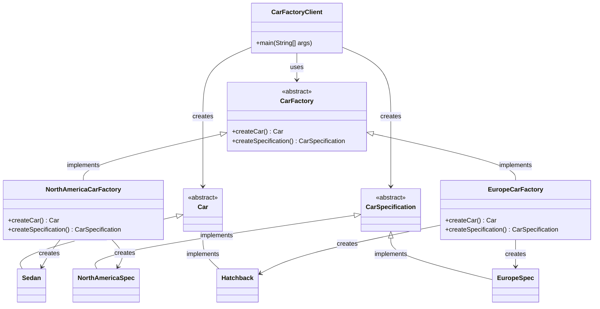

# Class Diagram of Abstract Factory Pattern

## Pattern Structure

### Components:

1. **Abstract Interface**: `CarFactory`
   - Declares methods for creating abstract products

2. **Concrete Factory 1**: `NorthAmericaCarFactory`
   - Implements creation methods for North America specific products

3. **Concrete Factory 2**: `EuropeCarFactory`
   - Implements creation methods for Europe specific products

4. **Abstract Products**: `Car`, `CarSpecification`
   - Define interfaces for product objects

5. **Concrete Products 1**: `Sedan`, `NorthAmericaSpec`
   - Products for North America market

6. **Concrete Products 2**: `Hatchback`, `EuropeSpec`
   - Products for Europe market

7. **Client**: `CarFactoryClient`
   - Uses only interfaces declared by Abstract Factory and Abstract Product classes

### Key Benefits:
- **Consistency**: Ensures related products are used together
- **Isolation**: Separates product creation from usage
- **Flexibility**: Easy to add new product families
- **Type Safety**: Compile-time checking of product compatibility