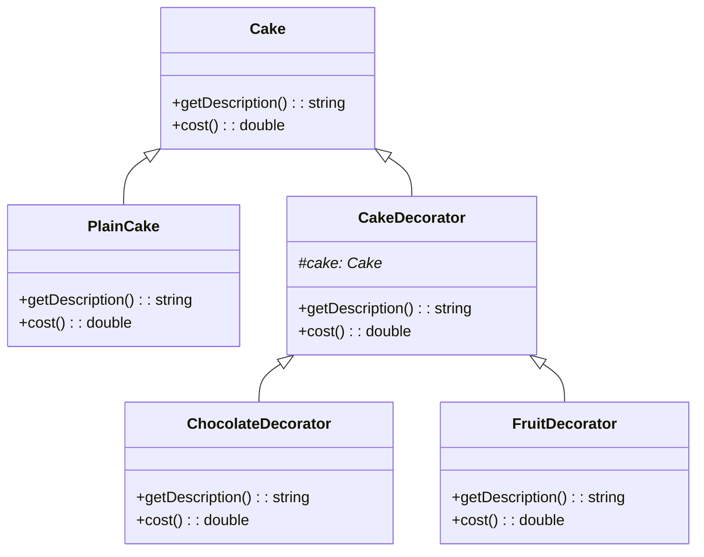

```mermaid

classDiagram
    Cake <|-- PlainCake
    Cake <|-- CakeDecorator
    CakeDecorator <|-- ChocolateDecorator
    CakeDecorator <|-- FruitDecorator

    class Cake{
        +getDescription(): string
        +cost(): double
    }

    class PlainCake{
        +getDescription(): string
        +cost(): double
    }

    class CakeDecorator{
        #cake: Cake*
        +getDescription(): string
        +cost(): double
    }

    class ChocolateDecorator{
        +getDescription(): string
        +cost(): double
    }

    class FruitDecorator{
        +getDescription(): string
        +cost(): double
    }
```