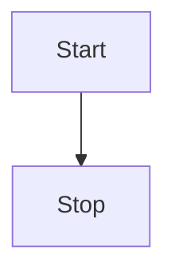
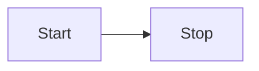
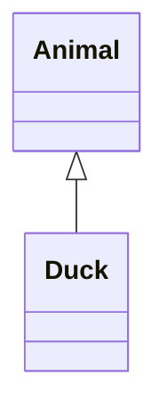

```mermaid
architecture-beta
    service user(mdi:account)
    service lambda(logos:aws-lambda)
    service cpp(logos:c-plusplus)

    user:R --> L:lambda
    lambda:R --> L:cpp

```

<!-- https://mermaid.js.org/syntax/flowchart.html -->

::: mermaid
graph TD;
    A-->B;
    A-->C;
    B-->D;
    C-->D;
:::

<!-- https://mermaid.js.org/syntax/classDiagram.html -->

---
title: Animal example
---

<!-- https://icon-sets.iconify.design/mdi/page-5.html -->
<!-- https://icon-sets.iconify.design/logos/ -->
<!--  -->
<!--  -->
<!--  -->
<!--  -->