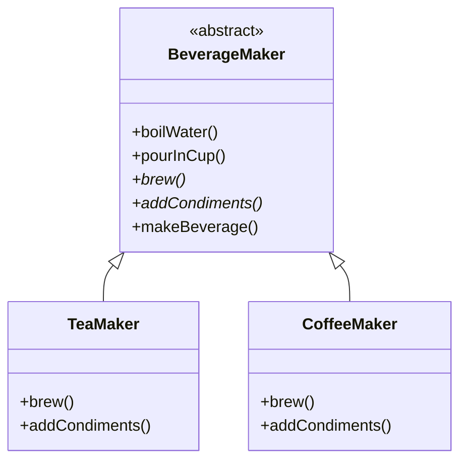

```mermaid
classDiagram
    BeverageMaker <|-- TeaMaker
    BeverageMaker <|-- CoffeeMaker

    class BeverageMaker{
        <<abstract>>
        +boilWater()
        +pourInCup()
        +brew()* 
        +addCondiments()*
        +makeBeverage()
    }

    class TeaMaker{
        +brew()
        +addCondiments()
    }

    class CoffeeMaker{
        +brew()
        +addCondiments()
    }
```